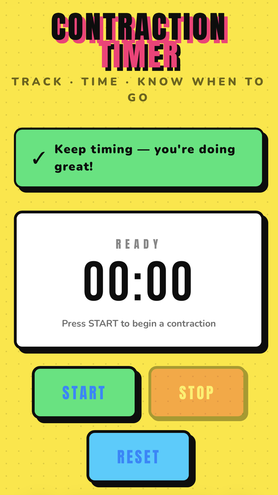

# Contraction Timer

A pop-art styled contraction timer web app for tracking labour contractions — duration, frequency, and when to head to hospital.

**Live app:** https://xhuw.github.io/Contraction-timer/

---

---

## Features

### Timer
- **START / STOP / RESET** buttons with pop-art ripple animations
- Large bold display using Bebas Neue / Anton fonts
- Live colour feedback during a contraction: green → orange (≥ 45s) → red (≥ 60s)
- **Rest counter** — after stopping, the same timer widget switches to a calm blue scheme and counts up time since the last contraction ended
- **Undo button** (↩ corner of timer card) — reverses the last START or STOP press; press multiple times to step back further; disabled when nothing to undo
- **Keyboard shortcut** — Spacebar to start/stop

### Data & persistence
- All state saved to `localStorage` on every action — survives page refresh, including mid-contraction
- Restoring a mid-contraction session resumes the timer from its original start time
- **RESET** prompts a confirmation modal before clearing data

### NHS hospital guidance
Three-tier indicator based on [NHS maternity guidance](https://www.nhs.uk/pregnancy/labour-and-birth/signs-that-labour-has-begun/):

| Level | Condition | Advice |
|---|---|---|
| Monitoring | Irregular or > 10 min apart | Stay home — rest, eat lightly, keep hydrated |
| Call your midwife | 5–10 min apart or ≥ 45s long | Call your maternity unit now |
| Go to hospital | ≤ 5 min apart AND ≥ 45s, 3+ contractions | Go to your maternity unit now |

Always call immediately for: waters breaking · heavy bleeding · reduced baby movements · or if you are worried at any point.

### Charts
- **Duration bar chart** — each contraction coloured green / orange / red by threshold
- **Frequency line chart** — interval between contractions in mm:ss, colour-coded by urgency
- Both charts update live after every contraction

### Contraction log
- Timestamped table: start time, duration, interval (mm:ss), status badge (OK / WATCH / ALERT)
- Newest entry at the top
- **Export CSV** button downloads the full log with headers
- Mobile-responsive: on small screens the `#` column is hidden, seconds are trimmed from the time, and padding tightens to fit without horizontal scrolling

### Design
- Pop art aesthetic: halftone dot background, bold offset box-shadows, neon palette (yellow, cyan, hot pink, lime green, red)
- Smooth animations throughout: title bounce, button ripples, stat bumps, row slide-in, modal pop
- Reset modal animates in with a bounce + slight rotate

## Usage

1. Press **START** when a contraction begins
2. Press **STOP** when it ends
3. Repeat — the app tracks rest time automatically and updates guidance as your pattern develops
4. Use **↩** to undo a misclick
5. Use **EXPORT CSV** to download your session log

## Reporting bugs

[Open an issue on GitHub](https://github.com/xhuw/Contraction-timer/issues/new)

## Support

If this app helped you, consider buying me a coffee:

